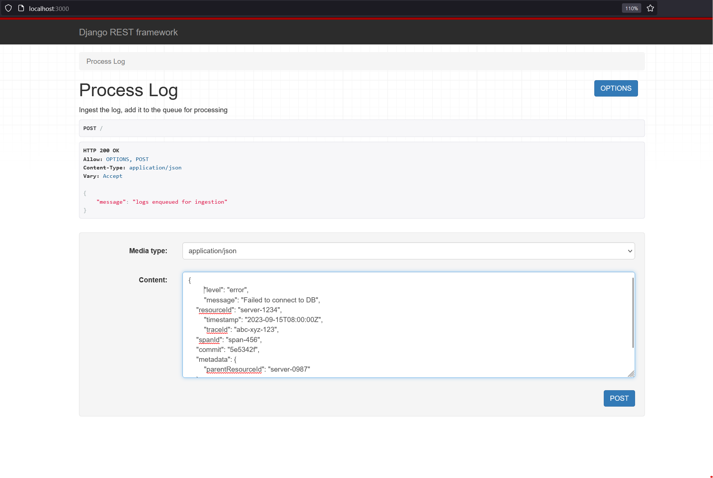
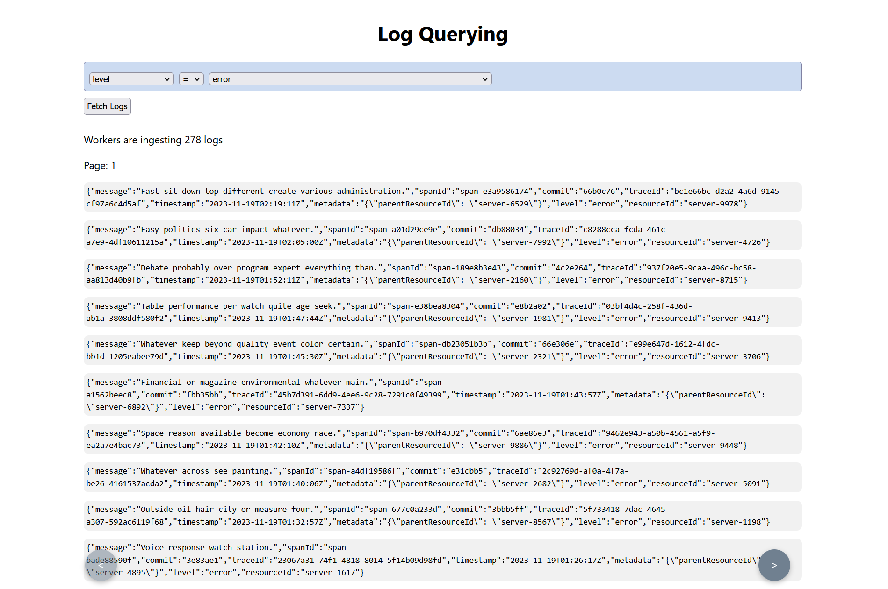
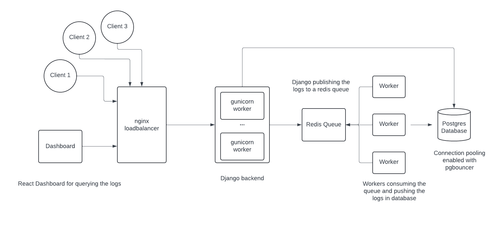

# Log ingestor and query interface


A log ingestion service with a query interface for querying the logs.


## Requirements and Getting Started

The following packages are required for running the project.
Also everything is tested on `Ubuntu 22.04.2 LTS`

```bash
[devbox]$ docker --version
Docker version 24.0.2, build cb74dfcdocker

[devbox]$ docker compose version  
Docker Compose version v2.18.1

[devbox]$ python --version
Python 3.10.12
```

To start the application and all the services run

```bash
[devbox]$ ./start.sh
#######################################
# Starting services in the background #
#######################################
[+] Building 0.0s (0/0)
[+] Running 7/7
 ✔ Container broker        Running                                                                                                                                                                                              0.0s
 ✔ Container db            Healthy                                                                                                                                                                                             13.3s
 ✔ Container pgbouncer     Running                                                                                                                                                                                              0.0s
 ✔ Container log_ingestor  Started                                                                                                                                                                                             14.0s
 ✔ Container worker        Started                                                                                                                                                                                             13.8s
 ✔ Container ingress       Started                                                                                                                                                                                             12.6s
 ✔ Container ui            Started                                                                                                                                                                                             12.9s
################################################################
# Waiting for all the services to come up, sleeping 15 seconds #
################################################################
##################################
# Performing database migrations #
##################################
Operations to perform:
  Apply all migrations: admin, auth, contenttypes, django_rq, log_ingestor, sessions
Running migrations:
  No migrations to apply.
#######################
# Creating admin user #
#######################
Superuser created successfully.

***********************************************************

log ingestor backend should be up on http://localhost:3000
query dashboard should be up on http://localhost:8080

***********************************************************
```

The script will start all the containers and setup the database also,
it will also create an django admin user for the admin panel

Admin user creds : 
```
username: admin
password: admin
```

After the execution of the startup script is done the following container should be up,
indicating successfull startup of the app

```bash
[devbox]$ docker ps -a
CONTAINER ID   IMAGE                          COMMAND                  CREATED          STATUS                    PORTS                                                 NAMES
4dde5e43e230   logging_service-ui             "docker-entrypoint.s…"   26 minutes ago   Up 26 minutes             8080/tcp, 0.0.0.0:8080->5173/tcp, :::8080->5173/tcp   ui
23bb2c45054e   nginx:1.17.6                   "nginx -g 'daemon of…"   26 minutes ago   Up 26 minutes             0.0.0.0:3000->80/tcp, :::3000->80/tcp                 ingress
b3df0275fc63   logging_service-worker         "supervisord -n"         26 minutes ago   Up 26 minutes             8000/tcp                                              worker
9648bf60b63c   logging_service-log_ingestor   "gunicorn log_ingest…"   26 minutes ago   Up 26 minutes             8000/tcp                                              log_ingestor
0b21111fecde   edoburu/pgbouncer:1.18.0       "/entrypoint.sh /usr…"   26 minutes ago   Up 26 minutes             0.0.0.0:5432->5432/tcp, :::5432->5432/tcp             pgbouncer
f69deefecbb2   postgres:15.2                  "docker-entrypoint.s…"   26 minutes ago   Up 26 minutes (healthy)   5432/tcp                                              db
a437dab688b2   redis:6.2-alpine               "docker-entrypoint.s…"   26 minutes ago   Up 26 minutes             0.0.0.0:6379->6379/tcp, :::6379->6379/tcp             broker
```


The main backend application should be up on `http://localhost:3000` and the UI should be up on `http://localhost:8080`


To stop the application use

```bash
[devbox]$ docker compose down
```

The postgres database and redis queue state will be preserved since `docker-volumes` are used, so unless the volumes are deleted the data is safe.


## Usage 

The following request will ingest a log in the database :

```bash
[devbox]$ cat log.json
{
  "level": "error",
  "message": "Failed to connect to DB",
  "resourceId": "server-1234",
  "timestamp": "2023-09-15T08:00:00Z",
  "traceId": "abc-xyz-123",
  "spanId": "span-456",
  "commit": "5e5342f",
  "metadata": {
    "parentResourceId": "server-0987"
  }
}

[devbox]$ curl -sX POST http://localhost:3000 -d @log.json --header "Content-Type: application/json"
{
  "message": "logs enqueued for ingestion"
}

```

Alternatively, by visiting `http://localhost:3000` django-rest-framework's UI can also be used to ingest logs.



To query the ingested logs, visit `http://localhost:8080`, 
The log filtering is provided on following fields
 - level
 - message (full text search)
 - resourceId
 - between two timestamps
 - traceId
 - spanId
 - commit
 - parentResourceId

The logs are fetched in a `paginated` manner. On one page `50` entries are shown.



## Architecture



- **Log Ingestion:**

    All the requests come to a nginx loadbalancer which acts as a reverse proxy and redirects the requests to django backend started with `gunicorn`, 
    to avoid latency in log ingestion, only payload verification is performed in the django app and the log ingestion part is performed asynchronously via
    a redis queue, this reduces the load on database also as the number of connections to maintain are less.

    Since django natively does not support connection pooling for database connection `pgbouncer` is used as the connection pooler for the `postgres` database.

    In a separate container multiple redis queue workers are spawned which fetch the tasks enqued by the django application, the workers ingest the logs in 
    the postgres database. This approach reduces latency but introduces some delay until the logs are saved. By default `12 workers` are started.

    On log querying UI live status of log ingestion progress is displayed.

- **Log querying:**

    All the fields which are being queried are indexed in the database to reduce the query time.
    
    For full-text-search on message field `ts_vector` data is stored in database, along with it a `gin index` is created on that column for faster lookup.

    When the backend is queried not all records are returned, the api is `paginated` to reduce the query time, 50 records are fetched at a time.


## Stress tests

Stress tested the application with `locust`, to run the `stress_test` script:

```bash

[devbox]$ python3 -m venv venv
[devbox]$ source venv/bin/activate
[devbox]$ pip install -r app/requirements.txt
[devbox]$ ./stress_test.sh
```

The test is run with 10000 users at a rate of 50 users spawning per second, it will run for about 40 seconds.

Output of the stress test:

```
Type     Name              # reqs      # fails |    Avg     Min     Max    Med |   req/s  failures/s
--------|----------------|-------|-------------|-------|-------|-------|-------|--------|-----------
POST     /                  14842     0(0.00%) |   1741      52   20283   1300 |  352.63        0.00
--------|----------------|-------|-------------|-------|-------|-------|-------|--------|-----------
         Aggregated         14842     0(0.00%) |   1741      52   20283   1300 |  352.63        0.00

Response time percentiles (approximated)
Type     Name                      50%    66%    75%    80%    90%    95%    98%    99%  99.9% 99.99%   100% # reqs
--------|--------------------|--------|------|------|------|------|------|------|------|------|------|------|------
POST     /                        1300   1800   2100   2200   2500   4800  11000  13000  19000  20000  20000  14842
--------|--------------------|--------|------|------|------|------|------|------|------|------|------|------|------
         Aggregated               1300   1800   2100   2200   2500   4800  11000  13000  19000  20000  20000  14842

```
